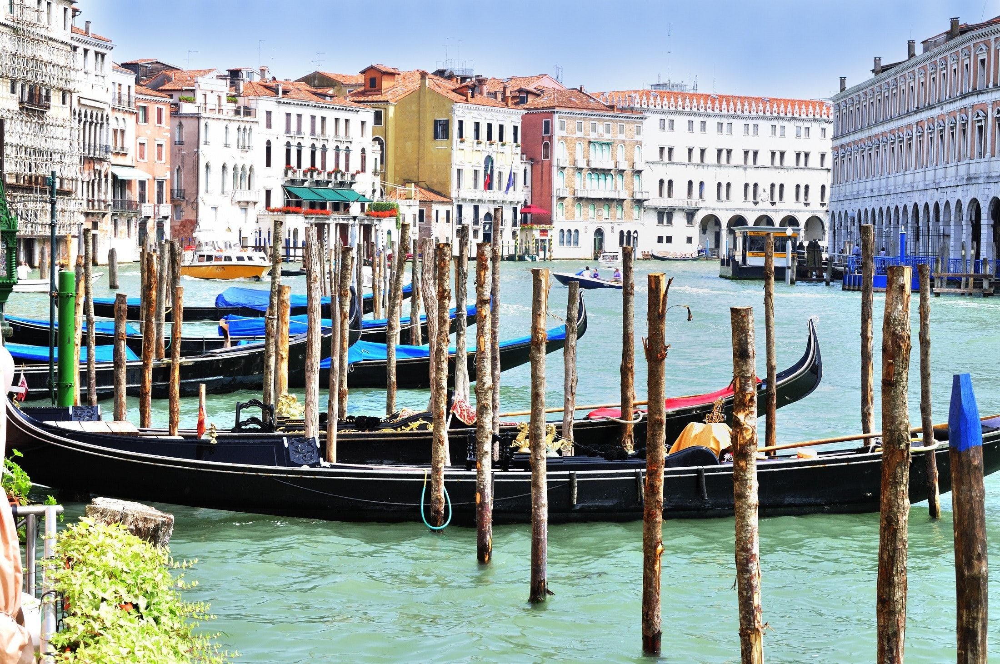

# flexbox-venice 🚤

This is my example of the flexbox method, by <a href="http://www.massimoceron.it" target="_blank">massimoceron.it</a> 
👉 <a href="http://ceron.altervista.org/corso-web-2.0/my-site/erika/flexbox-per-casa/index.html" target="_blank">Here's</a> the finally result. 
 

# benefits

<li> simple
<li> dependency free
 
  
# credits

<li> font by <a href="https://fonts.google.com/" target="_blank">Google Fonts</a>
<li> image by <a href="https://www.pexels.com/" target="_blank">Pexels</a>  
 
  
# description (in Italian 🇮🇹)

Il metodo Flexbox e&grave; una delle piu&grave; interessanti opzioni messe sul piatto dalle specifiche di CSS, che ha oramai raggiunto una compatibilità ragguardevole con i vari browser e che serve per la strutturazione di layout flessibili, con una procedura che risulta poi particolarmente semplificata nella gestione della parte Responsive di un sito.

                                
La regola di base del metodo, da applicare ad un contenitore, e&grave; <i>display: flex;</i>, grazie alla quale poi tutti i nostri elementi all’interno del contenitore stesso, privi di ulteriori regole, si distribuiranno su tutto lo spazio disponibile basandosi sul contenuto (come nel regolare flusso del codice verticale), ma comportandosi di fatto come se fosse stato loro assegnato un attributo float. 

                                
A <a href="https://www.venetoformazione.it/blog/flexbox-introduzione-e-primo-approccio/" target="_blank">questo</a> link e&grave; disponibile una breve guida di 5 lezioni con tutte le altre specifiche, regole proprieta&grave; e descrizioni, completa di esercizi di base per la strutturazione

                                
E questo esempio con alcuni testi e foto di Venezia e&grave; costruito con questo semplice ma efficace metodo che porta ad un risultato visibile sia da schermo intero che vedendo il comportamento dei vari box al restringere della finestra del browser (ossia al passaggio a viste con dispositivi aventi schermi di dimensione piu&grave; ridotta). 
                            	
PS: la favicon della gondola e&grave; presa da <a href="https://www.flaticon.com/" target="_blank">flaticon</a>.

                              
A <a href="http://ceron.altervista.org/corso-web-2.0/my-site/erika/flexbox-per-casa/index.html" target="_blank">questo </a>link puoi vedere il risultato finale del progetto.

                              
# image
  
 
