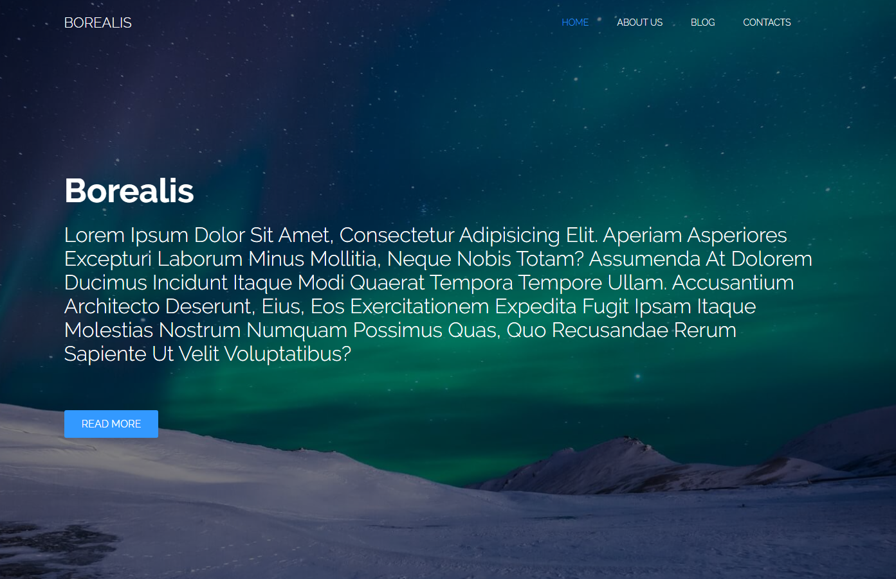
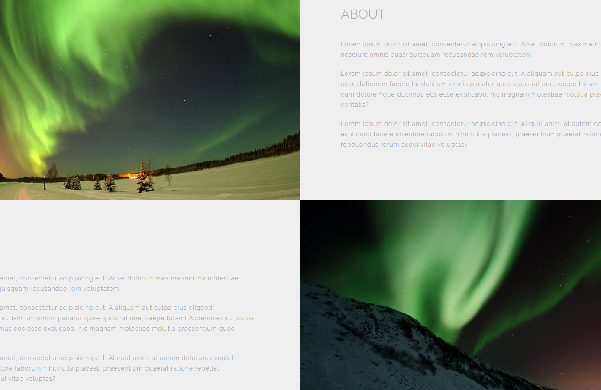

# flexbox-venice 🚤

This is my example of the flexbox method, by <a href="http://www.massimoceron.it" target="_blank">massimoceron.it</a> 
👉 <a href="http://ceron.altervista.org/corso-web-2.0/my-site/erika/flexbox-per-casa/index.html" target="_blank">Here's</a> the finally result. 
 

# benefits

<li> simple
<li> dependency free
 
  
# credits

<li> font by <a href="https://fonts.google.com/" target="_blank">Google Fonts</a>
<li> image by <a href="https://www.pexels.com/" target="_blank">Pexels</a>  
 

# screenshot
  
 

